# System Architecture: Resume RAG System and Job Matching Engine


## 1. System Overview


The system is composed of two sequential pipelines that share a single vector database as the integration boundary.


**Pipeline A - Ingestion** (`resume_rag.py`) runs once, or whenever new resumes are added. It reads raw resume files, extracts candidate metadata, chunks text by resume section, generates vector embeddings, and writes everything to a persistent ChromaDB collection.


**Pipeline B - Query** (`job_matcher.py`) runs on demand. It accepts a job description, embeds it, queries the same ChromaDB collection, applies hybrid filtering and scoring, and returns a ranked JSON result.


### AI Provider Stack


| Role | Provider | Configuration |
|---|---|---|
| **Embeddings** | HuggingFace | `EMBEDDING_MODEL` — any `sentence-transformers` model (default: `sentence-transformers/all-MiniLM-L6-v2`); runs locally, no API key required |
| **LLM** | Groq | `GROQ_API_KEY` + `GROQ_MODEL` — used for match reasoning and other generative text tasks at query time |


Both pipelines must use the **same** HuggingFace embedding model for resume chunks and job descriptions. Groq handles natural-language generation only; it does not produce embeddings.


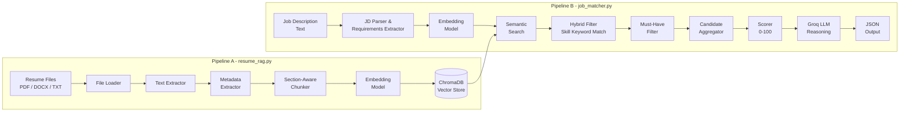


> The **Embedding Model** block in both pipelines must resolve to the **same HuggingFace embedding model**. Any mismatch will make similarity scores meaningless. The **Groq LLM** is used only after scoring to generate human-readable `reasoning` strings.


---


## 2. High-Level Component Map


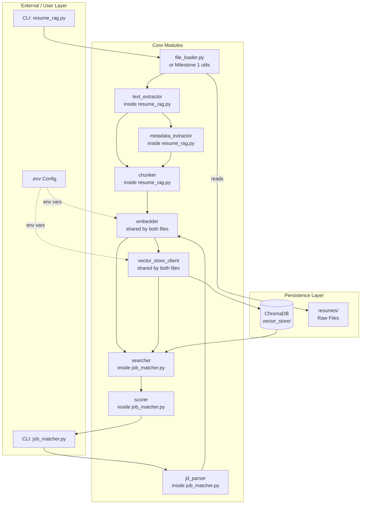


---


## 3. Pipeline A - Ingestion Architecture


### 3.1 Step-by-Step Data Flow


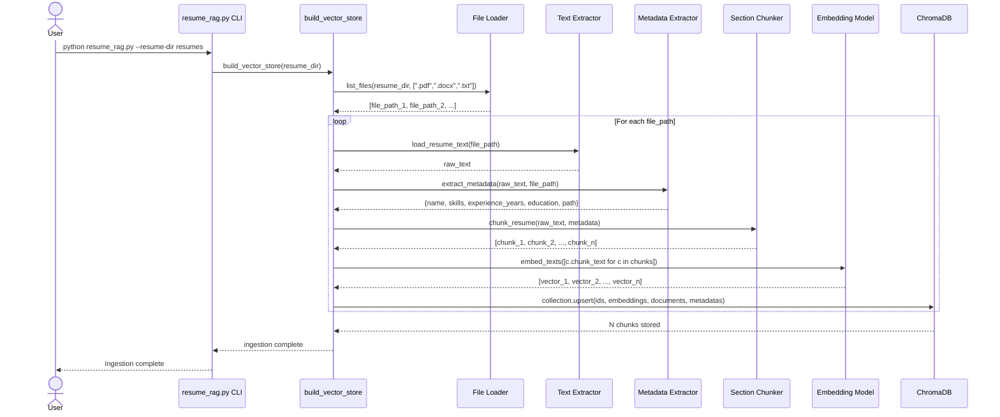


> **Orchestration note:** `build_vector_store()` is the sole orchestrator of Pipeline A. The File Loader only discovers file paths; it does not call MetaEx, Chunker, or Embedder. The CLI calls `build_vector_store(resume_dir)` once, and all downstream sub-functions run inside that function's loop.


### 3.2 File Loader Component


The loader is the entry point for ingestion. It should either reuse Milestone 1 file system utilities or implement equivalent logic using `pathlib`.


```
File Loader
├── Inputs : resume directory path, list of supported extensions
├── Reads  : .pdf via pypdf, .docx via python-docx, .txt via open()
├── Skips  : empty files, corrupted files, unsupported formats (with warning)
└── Outputs: list of (file_path, raw_text) tuples
```


Supported format routing:


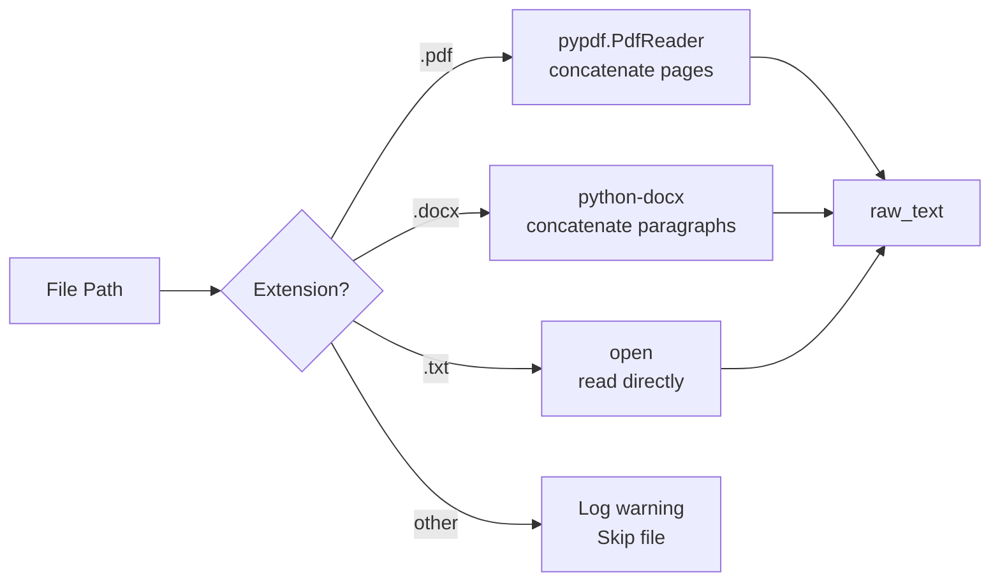


### 3.3 Section-Aware Chunker


The chunker is the most important component for quality retrieval. It must produce section-labelled chunks rather than arbitrary character splits.


```
Section-Aware Chunker
├── Step 1 : Normalize - collapse multiple newlines, strip leading/trailing whitespace
├── Step 2 : Detect - regex scan for section headings (EDUCATION, EXPERIENCE, SKILLS, etc.)
├── Step 3 : Split - divide text at detected headings, assign section_label to each block
├── Step 4 : Subchunk - if any section block > max_chars, split into overlapping windows
└── Step 5 : Filter - discard chunks shorter than min_chars (noise/headers)
```


Section heading regex (case-insensitive):


```python
SECTION_PATTERNS = {
    "summary"       : r"(summary|objective|profile|about me)",
    "skills"        : r"(skills|technical skills|technologies|competencies)",
    "experience"    : r"(experience|work experience|employment|work history)",
    "education"     : r"(education|academic|qualifications|degrees)",
    "projects"      : r"(projects|personal projects|key projects)",
    "certifications": r"(certifications|certificates|licenses)",
    "achievements"  : r"(achievements|accomplishments|awards|honors)",
}
```


Chunk size boundaries:


| Parameter | Value |
|---|---|
| Target chunk size | 500-900 characters |
| Overlap between subchunks | 50-150 characters |
| Minimum chunk size (keep) | 80 characters |


### 3.4 Metadata Extractor


Runs on the full resume text before chunking. Produces a flat dict that is attached to every chunk from that resume.


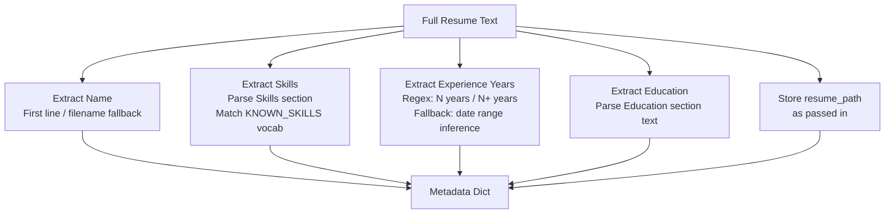


ChromaDB serialization constraint: `skills` must be stored as a comma-separated string `"Python,SQL,AWS"` because ChromaDB metadata values cannot be lists. Parse back on read.


### 3.5 Embedding Component


Shared between `resume_rag.py` and `job_matcher.py` via a common utility function or module. **Provider: HuggingFace `sentence-transformers` (local).**


```
Embedder
├── Reads  : EMBEDDING_MODEL from .env
├── Provider: HuggingFace sentence-transformers (runs on local CPU/GPU)
├── Call    : SentenceTransformer(MODEL).encode(texts)
│             Use any sentence-transformers model from the HuggingFace Hub.
└── Returns: list[list[float]] - one vector per input text
```


Both pipelines must call the **same** `get_embedding_model()` and `embed_texts()` functions. The embedding dimension must match the ChromaDB collection's dimension. Changing `EMBEDDING_MODEL` after ingestion requires a full re-ingestion.


| Model (examples) | Dimension |
|---|---:|
| `sentence-transformers/all-MiniLM-L6-v2` (default) | 384 |
| `sentence-transformers/all-mpnet-base-v2` | 768 |
| `BAAI/bge-small-en-v1.5` | 384 |


### 3.5.1 LLM Component (Groq)


Used at query time by `job_matcher.py` for generative tasks. **Provider: Groq Chat Completions API.**


```
LLM Client (Groq)
├── Reads  : GROQ_API_KEY and GROQ_MODEL from .env
├── Call   : groq client chat.completions.create(model=GROQ_MODEL, messages=[...])
├── Used by: Reasoning Generator (§4.7)
└── Returns: natural-language string for each match's reasoning field
```


Groq is not used for embeddings, metadata extraction, or JD parsing in the baseline architecture. Those steps remain rule-based; Groq enriches the final output with human-readable explanations.


### 3.6 ChromaDB Storage Schema


Each document stored in ChromaDB represents one resume chunk.


```
ChromaDB Collection: "resumes"
│
├── id           : "{resume_stem}_{section_label}_{chunk_index}"
│                  e.g. "john_doe_experience_2"
│                  ⚠ WARNING: stem-only IDs collide when two resume files share the
│                  same filename (e.g. two candidates both named "john_doe.pdf" from
│                  different directories). Safer alternative:
│                    id = hashlib.md5(resume_path.encode()).hexdigest()[:8]
│                         + f"_{section_label}_{chunk_index}"
│
├── document     : raw chunk text (str)
│
├── embedding    : list[float] - dense vector from embedding model
│
└── metadata     : {
       "candidate_name"  : "John Doe",            # str
       "resume_path"     : "resumes/john_doe.pdf", # str
       "section_label"   : "experience",           # str
       "chunk_index"     : 2,                      # int
       "skills"          : "Python,ML,SQL",        # str (comma-separated)
       "experience_years": 5,                      # int
       "education"       : "B.Tech CS"             # str
    }
```


> **Idempotent ingestion:** Use `collection.upsert()` instead of `collection.add()`. `add()` raises a duplicate-ID error if the same resume is processed twice. `upsert()` inserts new chunks and silently updates existing ones, making re-runs safe.


### 3.7 Shared Skill Vocabulary (KNOWN_SKILLS)


`KNOWN_SKILLS` is a canonical list of technology and skill tokens. It is consumed by **both** pipelines and must be identical in both scripts.


```python
KNOWN_SKILLS = [
    "Python", "SQL", "Java", "JavaScript", "TypeScript", "C++", "Go", "Rust",
    "Machine Learning", "Deep Learning", "NLP", "Computer Vision",
    "AWS", "Azure", "GCP", "Docker", "Kubernetes",
    "TensorFlow", "PyTorch", "scikit-learn", "pandas", "NumPy",
    "FastAPI", "Flask", "Django", "React", "Node.js",
    "PostgreSQL", "MongoDB", "Redis", "Elasticsearch",
    "Git", "Linux", "Spark", "Kafka", "Airflow",
    # extend as needed
]
```


| Location | How it is used |
|---|---|
| `resume_rag.py` — Metadata Extractor (§3.4) | Match tokens against resume text to populate the `skills` metadata field |
| `job_matcher.py` — JD Parser (§4.2) | Match tokens against JD text to determine `required_skills` |
| `job_matcher.py` — Scorer (§4.6) | Fallback for `skill_overlap_score` when the JD has no explicit required_skills |


> **Critical:** Define `KNOWN_SKILLS` once in a shared helper module (e.g. `skills_vocab.py`) and import it in both scripts. Any divergence between the ingestion-time vocabulary and the query-time vocabulary silently degrades skill matching.


---


## 4. Pipeline B - Query Architecture


### 4.1 Step-by-Step Data Flow


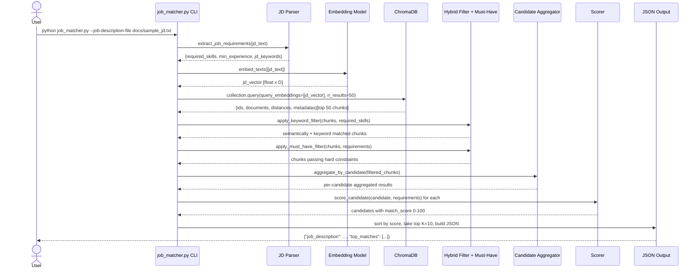


### 4.2 JD Parser Component


Parses the raw job description text to extract structured requirements.


```
JD Parser
├── Inputs : raw job description string
├── Extracts:
│   ├── required_skills     : intersect JD text with KNOWN_SKILLS vocab
│   ├── min_experience_years: regex "(\d+)\+?\s*years"
│   └── jd_keywords         : all tokens after stopword removal (for keyword scoring)
└── Outputs: {"required_skills": [...], "min_experience_years": int|None, "jd_keywords": [...]}
```


### 4.3 Hybrid Search Strategy


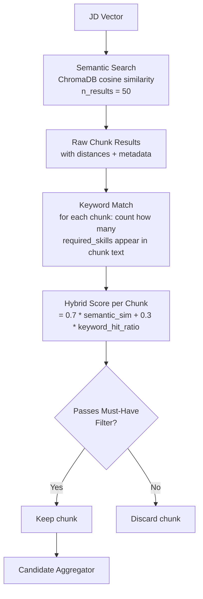


Oversampling: query ChromaDB for more chunks than K (e.g. 50) to give enough candidates after filtering. Return only top K=10 after aggregation and scoring.


> **Two-level scoring — important distinction:**
> The hybrid score shown here (`0.7 × semantic_sim + 0.3 × keyword_hit_ratio`) is a **chunk-level intermediate score** used only to rank and pre-filter individual chunks before aggregation. It is *not* the final candidate score. The final **candidate-level** 0–100 score uses a different set of signals and weights (`0.50 / 0.30 / 0.20`) and is computed in §4.6 *after* all chunks for a candidate have been aggregated by §4.5.


### 4.4 Must-Have Filter


Applied after hybrid scoring, before candidate aggregation.


```
Must-Have Filter
├── Input : list of chunks + extracted JD requirements
├── Rules :
│   ├── If required_skill NOT IN candidate.skills  -> exclude OR penalize score * 0.3
│   └── If candidate.experience_years < min_years  -> exclude OR penalize score * 0.5
├── Metadata-unavailable edge case:
│   └── Do NOT exclude; mark reasoning with "experience/skills data unavailable"
└── Output: filtered list of passing chunks
```


> **Chunk metadata carries candidate-level fields.** Every chunk from the same resume has identical `skills` and `experience_years` in its metadata (copied from the candidate's `extract_metadata` output). Dropping a chunk because its candidate fails a must-have constraint effectively excludes that candidate, since all their remaining chunks carry the same disqualifying metadata.


### 4.5 Candidate Aggregator


Vector DB results are at the chunk level. Aggregation maps them back to full candidates.


```
Candidate Aggregator
├── Group  : by resume_path (unique per candidate file)
├── Collect: all matching chunks per candidate
├── Merge  :
│   ├── semantic_score    = mean (or max) of per-chunk similarities after distance conversion:
│   │                       - cosine distance (ChromaDB default): similarity = 1 - distance
│   │                       - L2 distance:                        similarity = 1 / (1 + distance)
│   │                       Verify which distance function your collection uses (default: cosine).
│   ├── relevant_excerpts = top 2-3 chunks by individual similarity score
│   ├── matched_sections  = set of unique section_labels across matched chunks
│   └── metadata          = taken from any chunk (same for all from same resume)
└── Output : list of candidate dicts ready for scoring
```


### 4.6 Scoring Component


```
Scorer
├── Inputs : candidate dict + JD requirements dict
├── Signals:
│   ├── semantic_score      = aggregated cosine similarity -> [0, 1]
│   ├── skill_overlap_score = len(matched_skills) / len(required_skills) -> [0, 1]
│   │                         fallback = overlap with KNOWN_SKILLS if required_skills empty
│   └── experience_score    = min(candidate_years / required_years, 1.0) -> [0, 1]
│                             fallback = 0.5 if experience data unavailable
│
├── Formula:
│   final_score = (
│       semantic_score      * 0.50 +
│       skill_overlap_score * 0.30 +
│       experience_score    * 0.20
│   ) * 100
│
└── Output : float score in [0, 100], rounded to 1 decimal place
```


### 4.7 Reasoning Generator


Produces the human-readable `reasoning` string for each top match using the **Groq LLM** (§3.5.1).


```
Reasoning Generator
├── Inputs : candidate metadata, matched_skills, matched_sections, score signals, relevant excerpts
├── Prompt  : structured context passed to Groq with match score, skills, experience, and excerpts
├── LLM call: Groq chat completion via shared llm.py helper
├── Fallback: if Groq is unavailable, use template-based reasoning (skill, section, experience, score band)
└── Output  : single string summarising the match for a human reviewer
```


---


## 5. Data Models


### 5.1 Chunk (internal, used during ingestion and in DB)


```python
@dataclass
class ResumeChunk:
    chunk_id        : str        # "{stem}_{section}_{index}"
    resume_path     : str        # "resumes/john_doe.pdf"
    candidate_name  : str        # "John Doe"
    section_label   : str        # "experience" | "education" | ...
    chunk_text      : str        # raw text of this chunk
    chunk_index     : int        # sequential index within resume
    # candidate-level metadata (same for all chunks from same resume)
    skills          : str        # "Python,SQL" - comma-separated for ChromaDB
    experience_years: int        # 5
    education       : str        # "B.Tech CS"
    embedding       : list[float]  # populated after embed_texts()
```


### 5.2 CandidateResult (internal, post-aggregation)


```python
@dataclass
class CandidateResult:
    candidate_name   : str
    resume_path      : str
    skills           : list[str]       # parsed from comma-separated string
    experience_years : int
    education        : str
    matched_chunks   : list[ResumeChunk]
    semantic_score   : float           # [0, 1]
    matched_skills   : list[str]       # intersection with JD required_skills
    matched_sections : list[str]       # unique section_labels
    relevant_excerpts: list[str]       # top 2-3 chunk texts
```


### 5.3 JobRequirements (internal, from JD parser)


```python
@dataclass
class JobRequirements:
    raw_jd             : str
    required_skills    : list[str]   # e.g. ["python", "sql", "aws"]
    min_experience_years: int | None  # e.g. 5, or None if not stated
    jd_keywords        : list[str]   # all non-stopword tokens from JD
    jd_embedding       : list[float] # populated after embed_texts()
```


### 5.4 MatchOutput (final JSON-serialisable output)


```python
@dataclass
class MatchEntry:
    candidate_name  : str
    resume_path     : str
    match_score     : float          # 0-100
    matched_skills  : list[str]
    experience_years: int | None     # None when unavailable
    relevant_excerpts: list[str]
    reasoning       : str
    matched_sections: list[str]      # optional enrichment for UI


@dataclass
class MatchOutput:
    job_description : str
    top_matches     : list[MatchEntry]
```


---


## 6. Module Interaction and Shared Contract


The two application scripts interact through ChromaDB and shared helper code. `resume_rag.py` and `job_matcher.py` should not import each other, but they may both import the same embedding, config, and vector-store helpers so the collection name, persistence directory, and embedding model stay consistent.


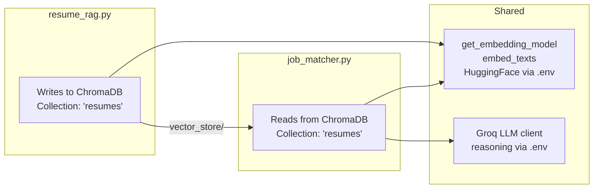


Rules of the shared contract:


1. The ChromaDB collection name must be the same in both scripts (from `CHROMA_COLLECTION_NAME` env var).
2. The ChromaDB persist directory must be the same (from `CHROMA_PERSIST_DIR` env var).
3. The HuggingFace embedding model must be identical. Both scripts call `get_embedding_model()` from the same source.
4. Groq LLM configuration (`GROQ_API_KEY`, `GROQ_MODEL`) is loaded from `.env` by the shared `llm.py` helper used in `job_matcher.py`.
5. Metadata keys written by `resume_rag.py` must match the keys read by `job_matcher.py`. Changing one without the other breaks retrieval.
6. `KNOWN_SKILLS` must be **identical** in both scripts (see §3.7). Any divergence silently breaks skill matching because metadata is written with one vocabulary and queried with another.


### 6.1 Public Module Interfaces


The architecture should expose the same interfaces described in `context.md`. These functions form the implementation boundary for the two assignment files.


`resume_rag.py`:


```python
def load_resume_text(file_path: str) -> str:
    """Extract raw text from TXT, PDF, or DOCX."""


def extract_metadata(text: str, resume_path: str) -> dict:
    """Extract candidate_name, skills, experience_years, education, and resume_path."""


def chunk_resume(text: str, metadata: dict) -> list[dict]:
    """Return section-aware chunks with metadata attached."""


def build_vector_store(resume_dir: str) -> None:
    """Load resumes, chunk them, embed them, and persist them to ChromaDB."""
```


`job_matcher.py`:


```python
def extract_job_requirements(job_description: str) -> dict:
    """Extract required skills, minimum experience, and useful keywords."""


def search_resumes(job_description: str, top_k: int = 10) -> list[dict]:
    """Run semantic search and return candidate-level matches."""


def score_candidate(candidate: dict, requirements: dict) -> float:
    """Combine semantic, skill, and experience signals into a 0-100 score."""


def match_jobs(job_description: str, top_k: int = 10) -> dict:
    """Return the final JSON-compatible match output."""
```


Shared helper module, optional but recommended:


```python
def get_embedding_model():
    """Load the configured embedding model once and reuse it."""


def embed_texts(texts: list[str]) -> list[list[float]]:
    """Embed a batch of strings via the HuggingFace sentence-transformers model."""


def generate_reasoning(prompt_context: dict) -> str:
    """Generate match reasoning text via the Groq LLM."""


def get_chroma_collection():
    """Return the configured ChromaDB collection."""
```


### 6.2 CLI Contracts


Both scripts should be usable from the command line with predictable flags.


| Script | Command | Required Behavior |
|---|---|---|
| `resume_rag.py` | `python resume_rag.py --resume-dir resumes --persist-dir vector_store` | Build or update the ChromaDB collection from local resumes. |
| `job_matcher.py` | `python job_matcher.py --job-description-file docs/sample_jd.txt --top-k 10` | Print the required JSON result to stdout. |


`top_k` should default to `10`, matching the original assignment. Internally, `job_matcher.py` may query more chunks, such as 50, then return only the top 10 candidates after aggregation and scoring.


## 7. Dependency Architecture


The architecture assumes a small local Python project with one `requirements.txt` file. The dependency groups map directly to the components above.


| Component | Required Packages | Notes |
|---|---|---|
| File parsing | `pypdf`, `python-docx` | TXT parsing uses the standard library. |
| Embeddings | `sentence-transformers` | Local HuggingFace model; set via `EMBEDDING_MODEL`. |
| LLM | `groq` | Groq Chat Completions API for match reasoning. |
| Vector DB | `chromadb` | Recommended local store. |
| Config | `python-dotenv` | Loads `.env` values. |
| Validation | `pydantic` or dataclasses | Keeps output stable and JSON-compatible. |


---


## 8. Storage Layer


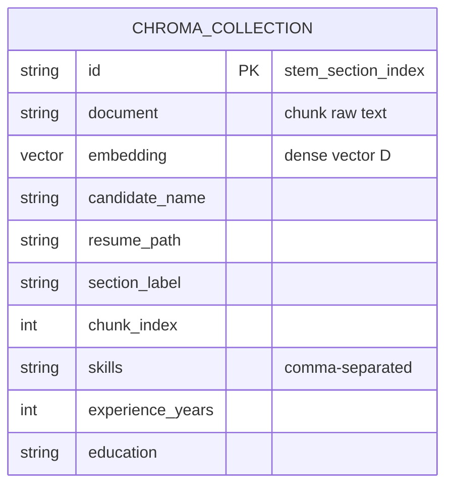


ChromaDB persists on disk under `vector_store/`. The directory contains SQLite and binary files managed by ChromaDB internally. Do not edit these files manually.


| File / Dir | Purpose |
|---|---|
| `vector_store/` | Root ChromaDB persistence directory |
| `vector_store/chroma.sqlite3` | Document metadata and IDs index |
| `vector_store/<uuid>/` | Binary HNSW index files for a collection |


---


## 9. Configuration and Environment


All runtime configuration is loaded from `.env` via `python-dotenv`. Neither script should have hardcoded values for paths, model names, or API keys.


```
.env
├── EMBEDDING_MODEL        = sentence-transformers/all-MiniLM-L6-v2   (any compatible sentence-transformers model)
├── GROQ_API_KEY           = gsk_...      (required — LLM reasoning)
├── GROQ_MODEL             = llama-3.3-70b-versatile  (or any supported Groq model)
├── CHROMA_PERSIST_DIR     = vector_store
└── CHROMA_COLLECTION_NAME = resumes
```


Configuration loading order: `.env` file -> environment variable -> default in code. The `.env` file must never be committed to version control.


---


## 10. End-to-End Request Flow


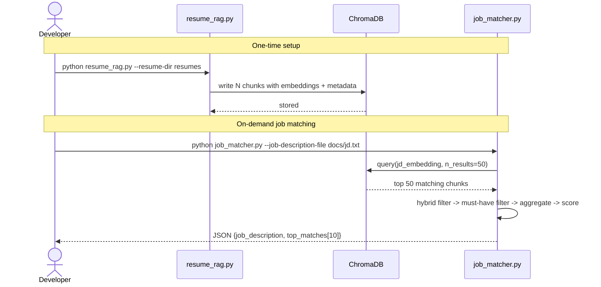


---


## 11. Validation and Acceptance Workflow


Validation should happen at three levels: ingestion correctness, retrieval correctness, and output correctness.


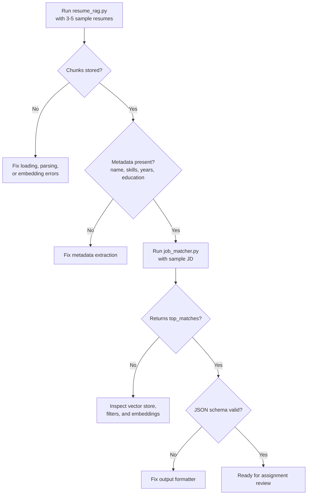


Acceptance checks mapped to the original requirements:


| Requirement | Architecture Check |
|---|---|
| Document chunking and embedding | Section-aware chunks exist and each chunk has an embedding. |
| Vector database | ChromaDB collection persists chunk text, embeddings, and metadata. |
| Retrieval pipeline | `job_matcher.py` queries the stored collection with a JD embedding. |
| Semantic search | Query uses vector similarity against resume chunk embeddings. |
| Hybrid search | Exact skill matching is combined with semantic results. |
| Ranking and scoring | Candidate-level score is normalized to 0-100. |
| Must-have filters | Required skills and minimum experience are checked before final ranking. |
| Output format | Final response contains `job_description` and `top_matches` with required fields. |


---


## 12. Failure Modes and Boundaries


| Stage | Failure Mode | Impact | Mitigation |
|---|---|---|---|
| File Loader | Corrupt PDF / DOCX | Single resume skipped | Try-except per file, warn and continue |
| Metadata Extractor | No name found | `candidate_name = "Unknown"` | Filename as fallback |
| Metadata Extractor | No experience years | `experience_years = 0` | Must-have filter uses partial penalty, not exclusion |
| Embedder | API rate limit / timeout | Ingestion or query fails | Retry with exponential backoff; batch size reduction |
| ChromaDB | Collection not found at query time | Hard failure | Check collection exists; prompt user to run `resume_rag.py` first |
| Scorer | No required_skills in JD | `skill_overlap_score` undefined | Default to KNOWN_SKILLS overlap or neutral 0.5 |
| Output | Zero candidates after filtering | Empty `top_matches` list | Return valid JSON with `top_matches: []`, do not raise exception |
| Ingestion | Re-run over already-indexed files | `collection.add()` raises duplicate-ID error | Use `collection.upsert()` so re-runs are idempotent (see §3.6) |


---


## 13. Scalability Notes


The current architecture targets small corpora (tens to hundreds of resumes). For production scale:


| Concern | Current Choice | Scale-Up Path |
|---|---|---|
| Vector DB | ChromaDB (local) | Pinecone or Weaviate (cloud, sharded) |
| Embeddings | HuggingFace sentence-transformers (local) | GPU batching or a managed embedding API at scale |
| LLM reasoning | Groq Chat API | Cache common reasoning patterns; batch where possible |
| Metadata filtering | Post-retrieval Python | ChromaDB `where` clause or Weaviate native hybrid |
| Concurrency | Single process | Async ingestion with `asyncio` or Celery workers |
| Resume deduplication | None | Hash file content; skip if hash already in DB |